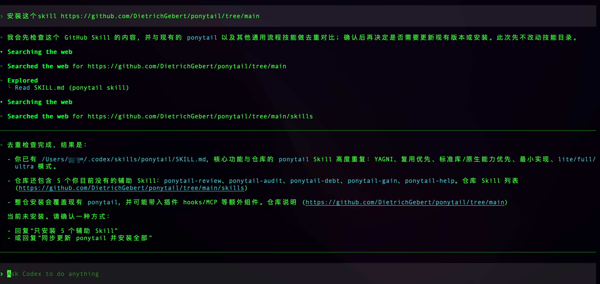
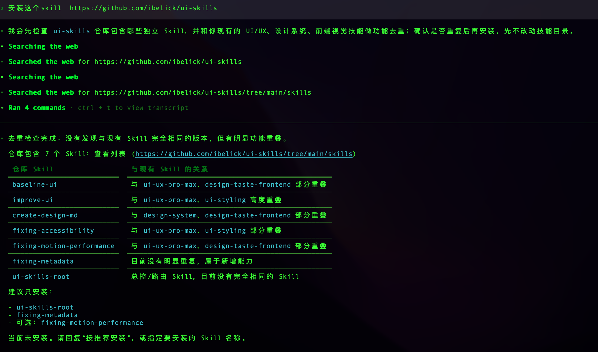

# Skill Overlap Guard

Skill 防重助手

Pre-install overlap checks for Agent Skills.

**Check before you install. Avoid redundant Agent Skills.**

安装前先查重，避免 Skill 越装越重复。

## Why

As your Skill collection grows, it becomes harder to know whether a new Skill
duplicates an existing capability.

## What it does

- Check a Skill before installation
- Audit overlap across installed Skills
- Classify `HIGH`, `partial`, and `complementary` relationships
- Match Chinese and English capability descriptions
- Guard Codex and terminal install flows
- Record explicit decisions in a Decision Registry

## Safety

- Never deletes, merges, replaces, or disables Skills automatically
- Changes to installed Skills require explicit user authorization

## Install

Clone into an Agent Skills root:

```bash
git clone https://github.com/EfanWang/skill-overlap-guard.git
```

Requires Python 3.9+ and `git`.

## Usage

Codex:

```text
$skill-overlap-guard 安装这个 skill https://github.com/owner/repo
```

Natural language:

```text
安装这个 skill https://github.com/xxx
```

Terminal:

```text
npx skills add owner/repo
```

Terminal Guard is disabled by default. It can be explicitly enabled for a
reversible dry-run check:

```bash
python scripts/terminal_guard.py enable
python scripts/terminal_guard.py status
python scripts/terminal_guard.py disable
```

### Examples

Codex natural-language check:



Codex natural-language check:



## How it works

```text
Source
  → Inventory
  → Recall
  → Semantic Review
  → Overlap Warning
  → User Confirmation
```

v0.1 reports overlap only. It never installs a Skill before explicit
confirmation.

## Status

v0.1.0 MVP

## Known Limitations

- GitHub is the only supported remote source.
- The v0.1 workflow reports install decisions; it does not perform installs.
- Local edits are not merged automatically.
- Plugin-managed and Cursor built-in Skills are outside the scan scope.

## Credits

Based on / derived from [EfanWang/skills-manager](https://github.com/EfanWang/skills-manager).

This project retains the MIT License and the original author's copyright
notice. See [LICENSE](LICENSE).
